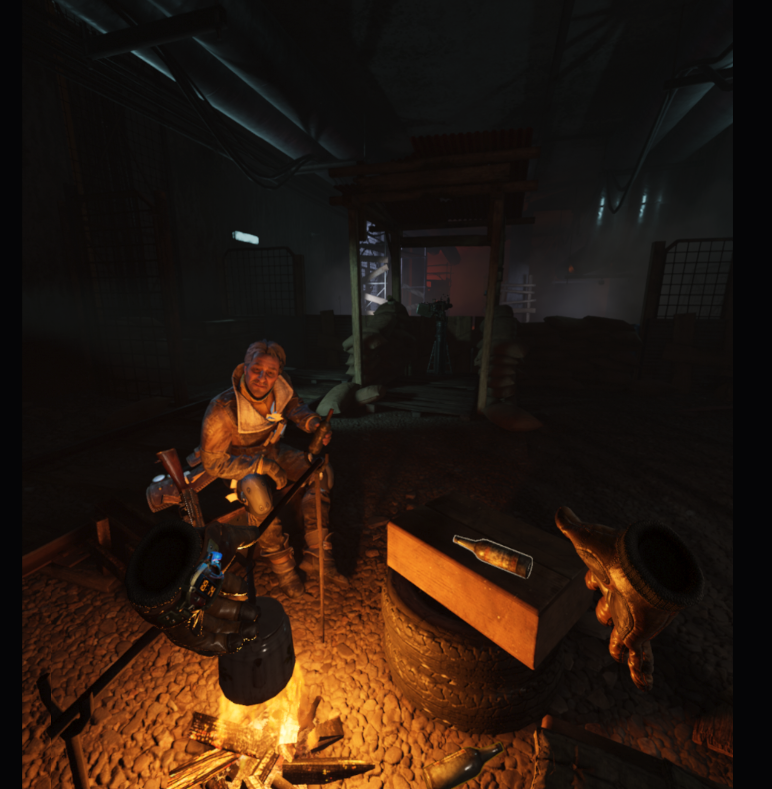

# Simple OpenVR Driver Tutorial

This repository is a fork of the original [Simple-OpenVR-Driver-Tutorial](https://github.com/terminal29/Simple-OpenVR-Driver-Tutorial) with additional improvements on top of the upstream tutorial project.

This fork is intended for VR emulation driver use cases where no physical VR headset is available. The driver can emulate a headset and controllers in software for development, testing, and input experimentation.

For emulation testing purposes, this fork has been tested with Unreal Engine 5 VR games, including Metro Awakening.



This fork also adds:

- OpenXR-compatible controller poses and bindings
- Added button mapping controls for A/B/X/Y controller inputs
- XInput controller support, including gamepad-driven headset and controller input
- Emulated HMD proximity reporting so SteamVR can treat the headset as worn

You will need to understand C++11 and some C++17 features at least to make the most use of this repo. It features:

- [Central driver setup](driver_files/src/Driver/IVRDriver.hpp)
to manage addition and removal of devices, and updating devices each frame, collecting events, access to OpenVR internals, etc...

- [Reading configuration files](driver_files/src/Driver/VRDriver.cpp#L114)
to load user settings 

- [Logging](driver_files/src/Driver/VRDriver.cpp#L142)
for simple debug messages

- [Tracked HMD](driver_files/src/Driver/HMDDevice.hpp)
which is a tracked device that can emulate a VR headset when no physical headset hardware is connected, including proximity reporting for headset-worn state

- [Tracked Controllers](driver_files/src/Driver/ControllerDevice.hpp)
which is a tracked device that has mapped controller buttons, triggers, joysticks, haptics, XInput support, and OpenXR-compatible bindings

- [Tracked Trackers](driver_files/src/Driver/TrackerDevice.hpp)
which is a device purely meant for tracking the location of an object

- [Tracking References (base stations)](driver_files/src/Driver/TrackingReferenceDevice.hpp)
which is a base station or camera designed as a fixed point of reference to the real world

- [Custom Device Render Models](driver_files/driver/example/resources/rendermodels/example_controller)
so your new controllers look cool

- [Visual Studio Debugging Setup for SteamVR](#debugging)
because a debugger is a developers best friend <sup>(besides ctrl-z)</sup>.

## Building
- Clone this fork and its submodules
	- `git clone --recursive https://github.com/Nmzik/OpenVR-Emulation-Driver.git`
- Build project with CMake
	- `cd OpenVR-Emulation-Driver && cmake .`
- Open project with Visual Studio and hit build
	- Driver folder structure and files will be copied to the output folder as `example`.
	
## Installation

There are two ways to "install" your plugin:

- Find your SteamVR driver directory, which should be at:
  `C:\Program Files (x86)\Steam\steamapps\common\SteamVR\drivers`
  and copy the `example` directory from the project's build directory into the SteamVR drivers directory. Your folder structure should look something like this:


or

- Navigate to `C:\Users\<Username>\AppData\Local\openvr` and find the `openvrpaths.vrpath` file. Open this file with your text editor of choice, and under `"external_drivers"`, add another entry with the location of the `example` folder. For example mine looks like this after adding the entry:

```json
{
	"config" : 
	[
		"C:\\Program Files (x86)\\Steam\\config",
		"c:\\program files (x86)\\steam\\config"
	],
	"external_drivers" : 
	[
		"C:\\Users\\<Username>\\Documents\\Programming\\c++\\Simple-OpenVR-Driver-Tutorial\\build\\Debug\\example"
	],
	"jsonid" : "vrpathreg",
	"log" : 
	[
		"C:\\Program Files (x86)\\Steam\\logs",
		"c:\\program files (x86)\\steam\\logs"
	],
	"runtime" : 
	[
		"C:\\Program Files (x86)\\Steam\\steamapps\\common\\SteamVR"
	],
	"version" : 1
}
```

## Current Controls
This fork supports keyboard/mouse input and the first connected XInput controller.

### HMD Controls
- `Space`: toggle mouse look for the emulated HMD
- Mouse: look around when mouse look is enabled
- Arrow keys: rotate the HMD
- `W/A/S/D`: move the HMD
- XInput right stick: HMD look by default
- XInput left stick: HMD movement when left joystick mode is disabled
- XInput D-pad: HMD movement
- The emulated HMD reports `/proximity` as active so SteamVR sees it as worn

### Controller Button Mapping
- Right controller: `E` = `A`, `R` = `B`
- Left controller: `Q` = `X`, `F` = `Y`
- XInput right controller buttons: `A`, `B`, `RT`, `RB`, right stick click, `Start`
- XInput left controller buttons: `X`, `Y`, `LB`, left stick click, `Back`
- `LT`: left trigger input until aim mode is engaged

### XInput Joystick Modes
- Left stick starts in left VR joystick mode
- Press `X + Y` to toggle the left stick between left VR joystick input and HMD movement
- Right stick starts in HMD look mode
- Press `A + B` to toggle the right stick between right VR joystick input and HMD look
- Holding `LT` enters aim mode for the right controller when the right stick is not in right joystick mode, replacing right-stick HMD look while held

### Haptics
- OpenVR haptic events are forwarded to XInput rumble

## Notes
- This fork is aimed at emulation and testing workflows, but SteamVR standby/sleep behavior can still vary across runtimes and individual games.
- Unreal Engine 5 commercial titles may not all respond identically to emulated headset activity even when the HMD proximity state is reported as active.

## Debugging
Debugging SteamVR is not as simple as it seems because of the startup procedure it uses. The SteamVR ecosystem consists of a couple programs:

 - **vrserver**: the driver host
 - **vrcompositor**: the render engine
 - **vrmonitor**: the popup that displays status information
 - **vrdashboard**: the VR menu/overlay
 - **vrstartup**: a program to start everything up
 
 To debug effectively in Visual Studio, you can use an extension called [Microsoft Child Process Debugging Power Tool](https://marketplace.visualstudio.com/items?itemName=vsdbgplat.MicrosoftChildProcessDebuggingPowerTool) and enable debugging child processes, disable debugging for all other child processes, and add `vrserver.exe` as a child process to debug as below:
  


Set the program the project should run in debug mode to **vrstartup** (Usually located `C:\Program Files (x86)\Steam\steamapps\common\SteamVR\bin\win64\vrstartup.exe`). Now we can start up SteamVR without needing to go through Steam, and can properly startup all the other programs vrserver needs. 

## Issues
I don't have an issue template, but if you find what you think is a bug, and can describe how to reproduce it, please leave an issue and/or pull request with the details.

## License
MIT License

Copyright (c) 2020 Jacob Hilton (Terminal29)

Permission is hereby granted, free of charge, to any person obtaining a copy
of this software and associated documentation files (the "Software"), to deal
in the Software without restriction, including without limitation the rights
to use, copy, modify, merge, publish, distribute, sublicense, and/or sell
copies of the Software, and to permit persons to whom the Software is
furnished to do so, subject to the following conditions:

The above copyright notice and this permission notice shall be included in all
copies or substantial portions of the Software.

THE SOFTWARE IS PROVIDED "AS IS", WITHOUT WARRANTY OF ANY KIND, EXPRESS OR
IMPLIED, INCLUDING BUT NOT LIMITED TO THE WARRANTIES OF MERCHANTABILITY,
FITNESS FOR A PARTICULAR PURPOSE AND NONINFRINGEMENT. IN NO EVENT SHALL THE
AUTHORS OR COPYRIGHT HOLDERS BE LIABLE FOR ANY CLAIM, DAMAGES OR OTHER
LIABILITY, WHETHER IN AN ACTION OF CONTRACT, TORT OR OTHERWISE, ARISING FROM,
OUT OF OR IN CONNECTION WITH THE SOFTWARE OR THE USE OR OTHER DEALINGS IN THE
SOFTWARE.
