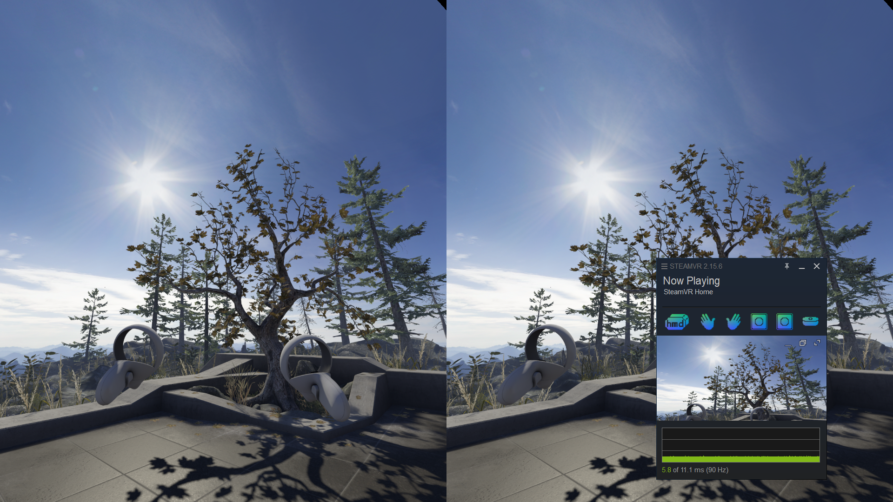

# OpenVR-Emulation-Driver

A fork of [OpenVR-Emulation-Driver by Nmzik](https://github.com/Nmzik/OpenVR-Emulation-Driver) (itself originally based on [Simple-OpenVR-Driver-Tutorial](https://github.com/terminal29/Simple-OpenVR-Driver-Tutorial)) focused on VR emulation when no physical headset is available — for development, testing, and input experimentation.

This fork: **https://github.com/omarekik/OpenVR-Emulation-Driver**

Tested with the SteamVR Demo app.



## What this fork adds

- **Configurable input mapping** via [`resources/input_mapping.ini`](driver_files/driver/example/resources/input_mapping.ini) — remap gamepad buttons, thresholds, and speeds without recompiling
- XInput gamepad support for HMD look/move and full controller input
- OpenXR-compatible controller poses and bindings
- A/B/X/Y button mapping for left and right controllers
- Emulated HMD proximity reporting so SteamVR treats the headset as worn
- Visual Studio debugger pre-configured to launch `vrstartup.exe` (set by CMake)
- A standalone [`preview_app`](preview_app/README.md) that mirrors a single SteamVR compositor eye into a desktop window

## Building

```sh
git clone --recursive https://github.com/omarekik/OpenVR-Emulation-Driver.git
cd OpenVR-Emulation-Driver
cmake -B build
```

Open `build/Simple_SteamVR_Driver_Tutorial.sln` in Visual Studio and build. The `example` driver folder is copied to the build output automatically.

## Installation

Choose one of two methods:

**Option A — copy into SteamVR drivers:**
Copy the built `example` folder into:
```
C:\Program Files (x86)\Steam\steamapps\common\SteamVR\drivers\
```

**Option B — register via `openvrpaths.vrpath`:**
Open `C:\Users\<Username>\AppData\Local\openvr\openvrpaths.vrpath` and add the path to the built `example` folder under `"external_drivers"`:

```json
{
    "external_drivers": [
        "C:\\path\\to\\build\\Debug\\example"
    ]
}
```

## Controls

All mappings are configurable in [`resources/input_mapping.ini`](driver_files/driver/example/resources/input_mapping.ini). Defaults are listed below.

### HMD

| Input | Action |
|---|---|
| Left stick X/Y | Look yaw / pitch |
| Left trigger | Move forward (analog) |
| Left trigger + LB | Move backward |
| Mouse (toggle `Space`) | Look yaw / pitch |

### Right Controller

| Input | Action |
|---|---|
| A button / `E` key | A button |
| B button / `R` key | B button |
| Right trigger | Trigger (click ≥ 75%) |
| RB | Grip |
| Right stick X/Y | VR joystick |
| Right stick click | Joystick click |
| Start | System button |
| D-pad ←/→ | Slide controller pose left / right |
| D-pad ↑/↓ | Slide controller pose forward / back |
| Gamepad Y | Raise controller pose |
| Gamepad X | Lower controller pose |

### Left Controller

| Input | Action |
|---|---|
| Back | System button |
| Left stick click | Joystick click |

> Left trigger, LB, left stick, and gamepad X/Y are consumed by HMD movement and right-controller pose adjustment and are not forwarded as left VR controller inputs.

### Haptics

OpenVR haptic events are forwarded to XInput rumble (left motor = left controller, right motor = right controller).

## Input Mapping Configuration

Edit `resources/input_mapping.ini` inside the driver folder and restart SteamVR to apply changes. No recompile needed.

```ini
[hmd]
look_speed        = 1.5   ; radians/sec for left-stick look
move_speed        = 1.0   ; m/s for left-trigger movement
mouse_sensitivity = 0.003 ; radians/pixel

[right_controller]
pose_move_speed         = 0.5  ; m/s for d-pad / X / Y pose adjustment
trigger_click_threshold = 0.75
```

See the file for all available keys and accepted value formats.

## Code Structure

| File | Purpose |
|---|---|
| [`IVRDriver.hpp`](driver_files/src/Driver/IVRDriver.hpp) | Central driver interface — device management, frame updates, OpenVR access |
| [`VRDriver.cpp`](driver_files/src/Driver/VRDriver.cpp) | Driver init, loads `InputConfig`, registers all devices |
| [`InputConfig.hpp/cpp`](driver_files/src/Driver/InputConfig.hpp) | INI-based input mapping config, parsed at startup |
| [`HMDDevice.hpp/cpp`](driver_files/src/Driver/HMDDevice.hpp) | Emulated HMD — look via left stick, move via left trigger, mouse look |
| [`ControllerDevice.hpp/cpp`](driver_files/src/Driver/ControllerDevice.hpp) | Controllers — buttons, triggers, joysticks, haptics, pose adjustment |
| [`TrackerDevice.hpp`](driver_files/src/Driver/TrackerDevice.hpp) | Generic object tracker |
| [`TrackingReferenceDevice.hpp`](driver_files/src/Driver/TrackingReferenceDevice.hpp) | Fixed-position base station / tracking reference |

## Debugging

SteamVR debugging requires attaching to a child process. The recommended setup:

1. Install [Microsoft Child Process Debugging Power Tool](https://marketplace.visualstudio.com/items?itemName=vsdbgplat.MicrosoftChildProcessDebuggingPowerTool)
2. Enable child process debugging, disable all child processes except `vrserver.exe`
3. The CMakeLists already sets the VS debugger command to:
   `C:\Program Files (x86)\Steam\steamapps\common\SteamVR\bin\win64\vrstartup.exe`

Press **F5** in Visual Studio to launch SteamVR and attach to `vrserver.exe`.


## Preview App

[`preview_app`](preview_app/README.md) is a small standalone OpenVR utility that mirrors one compositor eye into a desktop window. The default eye is set via `kPreviewEye` in [`SteamVRMirrorPreview.cpp`](preview_app/SteamVRMirrorPreview.cpp).

## License

MIT License — Copyright (c) 2020 Jacob Hilton (Terminal29), portions Copyright (c) 2026 omarekik

Permission is hereby granted, free of charge, to any person obtaining a copy of this software and associated documentation files (the "Software"), to deal in the Software without restriction, including without limitation the rights to use, copy, modify, merge, publish, distribute, sublicense, and/or sell copies of the Software, and to permit persons to whom the Software is furnished to do so, subject to the following conditions:

The above copyright notice and this permission notice shall be included in all copies or substantial portions of the Software.

THE SOFTWARE IS PROVIDED "AS IS", WITHOUT WARRANTY OF ANY KIND, EXPRESS OR IMPLIED, INCLUDING BUT NOT LIMITED TO THE WARRANTIES OF MERCHANTABILITY, FITNESS FOR A PARTICULAR PURPOSE AND NONINFRINGEMENT. IN NO EVENT SHALL THE AUTHORS OR COPYRIGHT HOLDERS BE LIABLE FOR ANY CLAIM, DAMAGES OR OTHER LIABILITY, WHETHER IN AN ACTION OF CONTRACT, TORT OR OTHERWISE, ARISING FROM, OUT OF OR IN CONNECTION WITH THE SOFTWARE OR THE USE OR OTHER DEALINGS IN THE SOFTWARE.


### Controller Button Mapping
- Right controller: `E` = `A`, `R` = `B`
- Left controller: `Q` = `X`, `F` = `Y`
- XInput right controller buttons: `A`, `B`, `RT`, `RB`, right stick click, `Start`
- XInput left controller buttons: `X`, `Y`, `LB`, left stick click, `Back`
- `LT`: left trigger input until aim mode is engaged

### XInput Joystick Modes
- Left stick starts in left VR joystick mode
- Press `X + Y` to toggle the left stick between left VR joystick input and HMD movement
- Right stick starts in HMD look mode
- Press `A + B` to toggle the right stick between right VR joystick input and HMD look
- Holding `LT` enters aim mode for the right controller when the right stick is not in right joystick mode, replacing right-stick HMD look while held

### Haptics
- OpenVR haptic events are forwarded to XInput rumble

## Notes
- This fork is aimed at emulation and testing workflows, but SteamVR standby/sleep behavior can still vary across runtimes and individual games.
- Unreal Engine 5 commercial titles may not all respond identically to emulated headset activity even when the HMD proximity state is reported as active.

## Preview App
This repository also includes [`preview_app`](preview_app/README.md), a small standalone OpenVR desktop utility that mirrors a single compositor eye into its own window.

I created it because I could not find a way to get the SteamVR compositor to render only one eye on its own. The app provides that focused single-eye preview instead, and defaults to the left eye through `kPreviewEye` in [`preview_app/SteamVRMirrorPreview.cpp`](preview_app/SteamVRMirrorPreview.cpp).

## Debugging
Debugging SteamVR is not as simple as it seems because of the startup procedure it uses. The SteamVR ecosystem consists of a couple programs:

 - **vrserver**: the driver host
 - **vrcompositor**: the render engine
 - **vrmonitor**: the popup that displays status information
 - **vrdashboard**: the VR menu/overlay
 - **vrstartup**: a program to start everything up
 
 To debug effectively in Visual Studio, you can use an extension called [Microsoft Child Process Debugging Power Tool](https://marketplace.visualstudio.com/items?itemName=vsdbgplat.MicrosoftChildProcessDebuggingPowerTool) and enable debugging child processes, disable debugging for all other child processes, and add `vrserver.exe` as a child process to debug as below:
  


Set the program the project should run in debug mode to **vrstartup** (Usually located `C:\Program Files (x86)\Steam\steamapps\common\SteamVR\bin\win64\vrstartup.exe`). Now we can start up SteamVR without needing to go through Steam, and can properly startup all the other programs vrserver needs. 

## Issues
I don't have an issue template, but if you find what you think is a bug, and can describe how to reproduce it, please leave an issue and/or pull request with the details.

## License
MIT License

Copyright (c) 2020 Jacob Hilton (Terminal29)

Permission is hereby granted, free of charge, to any person obtaining a copy
of this software and associated documentation files (the "Software"), to deal
in the Software without restriction, including without limitation the rights
to use, copy, modify, merge, publish, distribute, sublicense, and/or sell
copies of the Software, and to permit persons to whom the Software is
furnished to do so, subject to the following conditions:

The above copyright notice and this permission notice shall be included in all
copies or substantial portions of the Software.

THE SOFTWARE IS PROVIDED "AS IS", WITHOUT WARRANTY OF ANY KIND, EXPRESS OR
IMPLIED, INCLUDING BUT NOT LIMITED TO THE WARRANTIES OF MERCHANTABILITY,
FITNESS FOR A PARTICULAR PURPOSE AND NONINFRINGEMENT. IN NO EVENT SHALL THE
AUTHORS OR COPYRIGHT HOLDERS BE LIABLE FOR ANY CLAIM, DAMAGES OR OTHER
LIABILITY, WHETHER IN AN ACTION OF CONTRACT, TORT OR OTHERWISE, ARISING FROM,
OUT OF OR IN CONNECTION WITH THE SOFTWARE OR THE USE OR OTHER DEALINGS IN THE
SOFTWARE.
